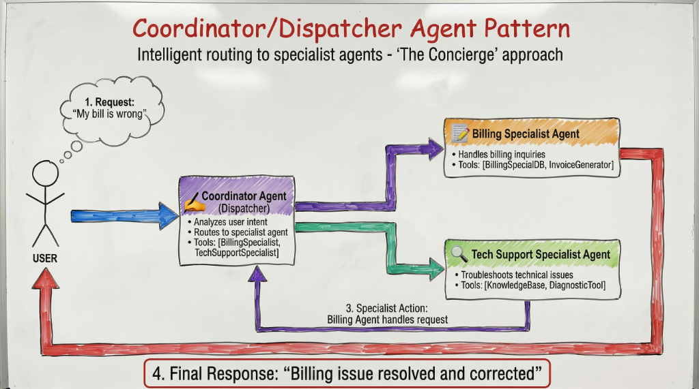

# Multi-Agent Conversational Support System

A Java-based intelligent support chat application featuring specialized agents for Technical Support and Billing inquiries, orchestrated by a Coordinator agent. Built with a hybrid RAG (Retrieval-Augmented Generation) pipeline and powered by Google Gemini.

---

## Table of Contents

- [Overview](#overview)
- [Architecture](#architecture)
- [Features](#features)
- [Project Structure](#project-structure)
- [RAG Pipeline](#rag-pipeline)
- [Setup](#setup)
- [Running the Application](#running-the-application)
- [Testing](#testing)
- [Test Example with LLM Judge](#test-example-with-llm-judge)
- [Documentation Sources](#documentation-sources)

---

## Overview

This system implements the **Coordinator/Dispatcher Agent Pattern** (also known as "The Concierge" approach), where a central coordinator agent analyzes user intent and intelligently routes requests to the most appropriate specialist agent. Each specialist has access to specific tools and documentation sources to handle domain-specific inquiries.

### Key Capabilities

| Capability | Description |
|------------|-------------|
| Intelligent Routing | Coordinator analyzes queries and routes to the correct specialist |
| Technical Support | Documentation-based troubleshooting with RAG retrieval |
| Billing Support | Refund processing, plan inquiries, policy search via tool calling |
| Multi-turn Conversations | Context maintained across conversation turns |
| Multilingual Support | Italian, English, and Polish language support |
| Graceful Handling | Out-of-scope requests handled appropriately |

---

## Architecture

The system follows a Coordinator/Dispatcher pattern where the Coordinator Agent acts as the first point of contact, analyzing user intent and routing to specialized agents.



### Agent Flow

1. **User Request**: The user sends a message to the system
2. **Coordinator Analysis**: The Coordinator Agent analyzes intent using an LLM
3. **Specialist Routing**: Request is routed to either:
   - **Billing Specialist Agent**: Handles refunds, payments, plan information
   - **Technical Support Agent**: Handles errors, integrations, troubleshooting
4. **Tool Execution**: Specialists use available tools to gather information
5. **Final Response**: Formatted response returned to the user

---

## Features

### Coordinator Agent
- Intelligent intent classification using LLM
- Dynamic routing based on conversation context
- Handles agent switching mid-conversation
- Graceful handling of out-of-scope requests

### Technical Specialist Agent
- Answers questions based strictly on local documentation
- Uses hybrid RAG pipeline for accurate retrieval
- Covers: troubleshooting, API integration, system requirements, installation
- Available tools:
  - `search_documentation`: Searches technical documentation using hybrid semantic + keyword search (RAG pipeline)

### Billing Specialist Agent
- Tool-calling capabilities for actions and queries
- Available tools:
  - `open_refund_case`: Opens a refund case with email and reason
  - `get_refund_timeline`: Returns processing times by plan/refund type
  - `search_billing_policy`: Searches billing policy documentation

### CLI Interface
- Interactive command-line interface
- Commands: `clear` (reset context), `quit` (exit)

---

## Project Structure

```
agentscodingchallenge/
├── app/src/main/java/org/example/
│   ├── App.java                    # Main application entry point
│   ├── agent/
│   │   ├── Agent.java              # Agent interface
│   │   ├── AgentType.java          # Agent type enum
│   │   ├── CoordinatorAgent.java   # Main routing coordinator
│   │   ├── BillingSpecialistAgent.java
│   │   └── TechnicalSpecialistAgent.java
│   ├── llm/
│   │   ├── LLMClient.java          # LLM client interface
│   │   └── GeminiClient.java       # Google Gemini implementation
│   ├── model/
│   │   ├── ConversationContext.java
│   │   └── ConversationMessage.java
│   ├── rag/                        # RAG pipeline components
│   │   ├── HybridRetriever.java    # Orchestrates full pipeline
│   │   ├── DocumentChunker.java    # Markdown chunking
│   │   ├── BM25Index.java          # Lucene-based lexical search
│   │   ├── VectorStore.java        # Semantic vector search
│   │   ├── EmbeddingService.java   # DJL embedding service
│   │   ├── RRFMerger.java          # Reciprocal Rank Fusion
│   │   └── Reranker.java           # Final reranking
│   └── tools/
│       ├── Tool.java               # Tool interface
│       ├── OpenRefundCaseTool.java
│       ├── RefundTimelineTool.java
│       ├── BillingPolicyTool.java
│       └── DocumentRetrievalTool.java
├── app/src/main/resources/docs/    # Documentation sources
│   ├── billing_policy.md
│   ├── troubleshooting.md
│   ├── integration_guide.md
│   ├── system_requirements.md
│   ├── installation.md
│   └── faq.md
├── TEST_SET_EN.md                  # English test cases
├── TEST_SET_IT.md                  # Italian test cases
├── TEST_SET_PL.md                  # Polish test cases
└── .env                            # API key configuration
```

---

## RAG Pipeline

The system implements a **Hybrid Retrieval-Augmented Generation** pipeline that combines lexical and semantic search for optimal document retrieval.

### Pipeline Components

```
┌─────────────────────────────────────────────────────────────────────┐
│                        HYBRID RAG PIPELINE                          │
├─────────────────────────────────────────────────────────────────────┤
│                                                                     │
│  ┌──────────────┐    ┌───────────────────────────────────────────┐ │
│  │   Document   │───>│           Document Chunker                │ │
│  │   Sources    │    │  - Splits by ## headers (Markdown)        │ │
│  │  (.md files) │    │  - Max chunk size: 1000 chars             │ │
│  └──────────────┘    │  - Overlap: 100 chars for context         │ │
│                      │  - Preserves ### sub-headers              │ │
│                      └─────────────────┬─────────────────────────┘ │
│                                        │                           │
│                         ┌──────────────┴──────────────┐            │
│                         v                             v            │
│              ┌──────────────────┐          ┌──────────────────┐   │
│              │    BM25 Index    │          │   Vector Store   │   │
│              │  (Apache Lucene) │          │  (In-memory)     │   │
│              │                  │          │                  │   │
│              │  Lexical search  │          │ Semantic search  │   │
│              │  Keyword matching│          │ Cosine similarity│   │
│              └────────┬─────────┘          └────────┬─────────┘   │
│                       │                             │              │
│                       │      ┌──────────────┐       │              │
│                       └─────>│  RRF Merger  │<──────┘              │
│                              │              │                      │
│                              │  Reciprocal  │                      │
│                              │  Rank Fusion │                      │
│                              │   (k=60)     │                      │
│                              └──────┬───────┘                      │
│                                     │                              │
│                                     v                              │
│                            ┌──────────────┐                        │
│                            │   Reranker   │                        │
│                            │              │                        │
│                            │ Final top-K  │                        │
│                            │  selection   │                        │
│                            └──────────────┘                        │
│                                                                     │
└─────────────────────────────────────────────────────────────────────┘
```

### Component Details

| Component | Technology | Description |
|-----------|------------|-------------|
| **DocumentChunker** | Custom | Splits Markdown documents by `##` headers with overlap for context preservation |
| **BM25Index** | Apache Lucene | Lexical search using BM25 ranking algorithm for keyword matching |
| **VectorStore** | In-memory + DJL | Semantic search using dense embeddings with cosine similarity |
| **EmbeddingService** | DJL (Deep Java Library) | Generates embeddings using `nomic-embed-text-v2-moe` model |
| **RRFMerger** | Custom | Reciprocal Rank Fusion to combine BM25 and vector search results |
| **Reranker** | Custom | Final reranking and top-K selection |

### Retrieval Flow

1. **Query Processing**: User query is passed to both BM25 and Vector search
2. **BM25 Search**: Returns top 50 lexically matching chunks
3. **Vector Search**: Returns top 50 semantically similar chunks
4. **RRF Fusion**: Merges both lists using Reciprocal Rank Fusion (k=60)
5. **Reranking**: Final selection of top 5 most relevant chunks
6. **Context Injection**: Retrieved chunks are injected into agent prompt

### Configuration

| Parameter | Value | Description |
|-----------|-------|-------------|
| BM25_TOP_K | 50 | Initial BM25 candidates |
| VECTOR_TOP_K | 50 | Initial vector search candidates |
| RRF_TOP_K | 20 | After fusion |
| FINAL_TOP_K | 5 | Final results to agent |
| MAX_CHUNK_SIZE | 1000 chars | Maximum chunk size |
| OVERLAP_SIZE | 100 chars | Overlap between chunks |

---

## Setup

### Prerequisites

- Java 21+
- Gradle (wrapper included)
- Google Gemini API Key

### Configuration

1. Create a `.env` file in the project root:

```bash
GEMINI_API_KEY=your_api_key_here
GEMINI_MODEL=gemini-2.0-flash  # Optional, defaults to gemini-2.0-flash
```

2. Ensure all documentation files are present in `app/src/main/resources/docs/`

---

## Running the Application

Run the application using Gradle:

```bash
./gradlew run --console=plain
```

### Usage Examples

**Technical Support:**
```
You: I get CONN_TIMEOUT error, what should I do?
[Technical Specialist] Here are the troubleshooting steps for connection timeout...
```

**Billing Support:**
```
You: I would like a refund. Email: test@example.com. Reason: slow service
[Billing Specialist] I've opened refund case REF-XXXX. Please complete the form at...
```

**Control Commands:**
- `clear` - Reset conversation context
- `quit` - Exit the application

---

## Testing

The test suite uses JUnit 5 with dynamic test generation from Markdown test case files. Tests are validated using an LLM Judge that evaluates semantic correctness.

### Run All Tests

```bash
./gradlew :app:test --tests "org.example.MultiAgentSystemTest"
```

### Filter by Language

```bash
# Italian tests only
./gradlew :app:test --tests "org.example.MultiAgentSystemTest" -Dtest.lang=it

# English tests only
./gradlew :app:test --tests "org.example.MultiAgentSystemTest" -Dtest.lang=en

# Polish tests only
./gradlew :app:test --tests "org.example.MultiAgentSystemTest" -Dtest.lang=pl
```

### Filter by Category

```bash
# Chapter 4 only (Edge Cases)
./gradlew :app:test --tests "org.example.MultiAgentSystemTest" -Dtest.chapter=4

# Chapter 4 Italian only
./gradlew :app:test --tests "org.example.MultiAgentSystemTest" -Dtest.lang=it -Dtest.chapter=4
```

### Run Specific Test

```bash
# Single test by ID
./gradlew :app:test --tests "org.example.MultiAgentSystemTest" -Dtest.id=1.1

# Single test in specific language
./gradlew :app:test --tests "org.example.MultiAgentSystemTest" -Dtest.lang=en -Dtest.id=1.1
```

---

## Test Example with LLM Judge

The testing framework uses an LLM-as-Judge approach to evaluate whether agent responses semantically satisfy expected behaviors. This allows for flexible validation that does not require exact string matching.

### Test Case Example (from TEST_SET_EN.md)

```markdown
#### TEST 1.1 - Refund request with complete data
**Input:**
I would like a refund. Email: test@example.com. Reason: slow service

**Expected Behavior:**
- Agent calls `open_refund_case` tool
- Returns Case ID (REF-XXXX)
- Provides the direct link to the refund form
- Explains next steps (7 business days to complete form)
```

### Judge Evaluation Process

When running test 1.1, the system:

1. **Sends Input**: "I would like a refund. Email: test@example.com. Reason: slow service"

2. **Receives Agent Response**:
```
I've opened a refund case for you.

Case ID: REF-8742
Refund Form: https://billing.example.com/refund?case=REF-8742

Please complete the form within 7 business days to process your refund.
Your refund will be processed within 5-7 business days after form completion.
```

3. **LLM Judge Evaluation**:
The judge receives:
```
Test Case: 1.1 - Refund request with complete data
Language: EN
User Input: I would like a refund. Email: test@example.com. Reason: slow service

Expected Behavior/Response:
- Agent calls `open_refund_case` tool
- Returns Case ID (REF-XXXX)
- Provides the direct link to the refund form
- Explains next steps (7 business days to complete form)

Actual Agent Response:
I've opened a refund case for you.
Case ID: REF-8742
Refund Form: https://billing.example.com/refund?case=REF-8742
Please complete the form within 7 business days to process your refund.
```

4. **Judge Verdict**:
```
STATUS: PASS
REASON: The response contains a valid Case ID (REF-8742), provides the refund form link,
and explains the 7 business day deadline. All expected elements are present.
```

### Judge Guidelines

The LLM Judge follows these principles:

- **Semantic Correctness**: Focus on meaning, not exact wording
- **Multilingual Equivalence**: Treat translated terms as semantically identical across languages
- **Tool Inference**: If response contains correct info, assume tool was called
- **Additional Details**: Extra helpful information is acceptable
- **Failure Criteria**: Only fail if key expected information is missing or incorrect

---

## Documentation Sources

The Technical Specialist has access to 6 documentation sources:

| Document | Contents |
|----------|----------|
| `troubleshooting.md` | Error codes, connection issues, debugging steps |
| `integration_guide.md` | API authentication, OAuth flow, webhooks |
| `system_requirements.md` | SDK requirements, self-hosted deployment specs |
| `installation.md` | Linux/Windows/macOS installation, SDK setup |
| `faq.md` | Frequently asked questions |
| `billing_policy.md` | Plans, pricing, refund policy, payment methods |

---

## Test Coverage Summary

| Category | Total Tests |
|----------|-------------|
| Billing Capabilities | 9 |
| Technical Documentation | 11 |
| Agent Routing | 4 |
| Edge Cases | 3 |
| Multi-Turn Conversations | 3 |
| **TOTAL per language** | **30** |
| **TOTAL (3 languages)** | **90** |

---

## License

MIT License - see LICENSE file for details.